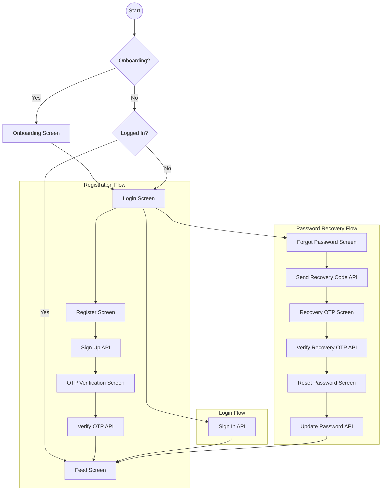

# Authentication Flow

This document describes the authentication flows implemented in the Lokito app using Supabase and Riverpod.

## 1. Overview Diagram

## 2. Key Features

### Email Enumeration Protection
To enhance security, the "Forgot Password" flow does not confirm whether an account exists. The UI always displays a success message, even if the email isn't registered, preventing attackers from harvesting user emails.

### Auto-Initialization
The `AuthController` automatically checks for an existing session on app startup.
- If a session is valid: Directs to **Feed**.
- If a session requires email verification: Directs to **OTP Screen**.
- If no session: Directs to **Onboarding/Login**.

### Resend Timer
To prevent API spamming, a 60-second countdown is implemented for the "Resend Code" button in both Registration and Recovery flows.

## 3. Tech Stack
- **Backend:** Supabase Auth (PKCE Flow).
- **State Management:** Riverpod (NotifierProvider).
- **Navigation:** GoRouter (Centralized redirect logic in `app_router.dart`).
- **Translations:** Slang (Type-safe i18n).

---
*Lokito Documentation - 2026*
