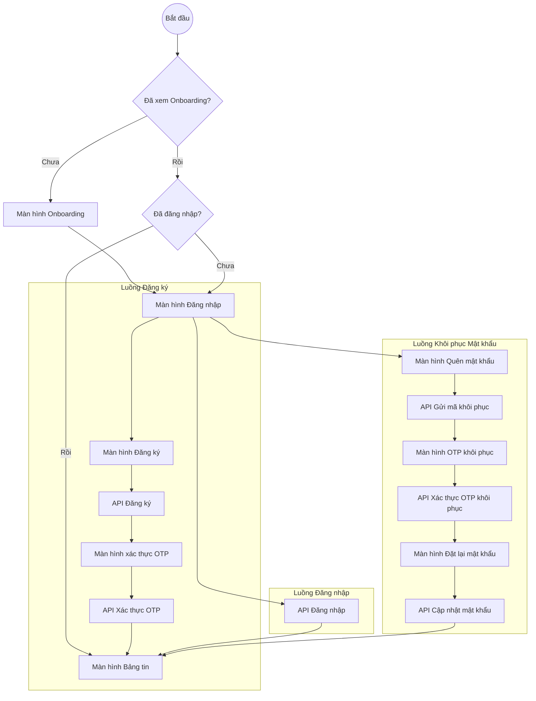

# Luồng Xác thực (Auth Flow)

Tài liệu này mô tả các luồng xác thực được triển khai trong ứng dụng Lokito sử dụng Supabase và Riverpod.

## 1. Biểu đồ Tổng quan

## 2. Các Tính năng Chính

### Bảo vệ rò rỉ Email (Email Enumeration Protection)
Để tăng cường bảo mật, luồng "Quên mật khẩu" không xác nhận tài khoản có tồn tại hay không. Giao diện luôn hiển thị thông báo thành công, ngay cả khi email chưa được đăng ký, nhằm ngăn chặn kẻ tấn công thu thập danh sách email người dùng.

### Tự động khởi tạo (Auto-Initialization)
`AuthController` tự động kiểm tra phiên làm việc hiện có khi ứng dụng khởi động:
- Nếu phiên hợp lệ: Chuyển đến **Bảng tin**.
- Nếu phiên yêu cầu xác thực email: Chuyển đến **Màn hình OTP**.
- Nếu không có phiên: Chuyển đến **Onboarding/Đăng nhập**.

### Bộ đếm thời gian gửi lại (Resend Timer)
Để ngăn chặn spam API, một bộ đếm ngược 60 giây được triển khai cho nút "Gửi lại mã" trong cả luồng Đăng ký và Khôi phục.

## 3. Công nghệ sử dụng
- **Backend:** Supabase Auth (PKCE Flow).
- **Quản lý trạng thái:** Riverpod (NotifierProvider).
- **Navigation:** GoRouter (Logic chuyển hướng tập trung trong `app_router.dart`).
- **Dịch ngôn ngữ:** Slang (i18n kiểu safe-type).

---
*Tài liệu Lokito - 2026*
