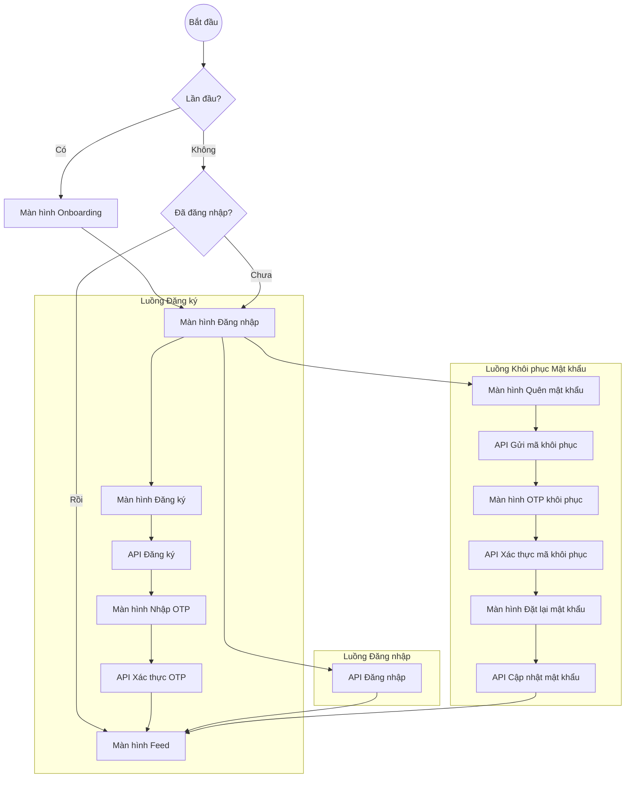

# Luồng Xác Thực (Authentication Flow)

Tài liệu này mô tả các luồng đăng ký, đăng nhập và khôi phục mật khẩu được triển khai trong ứng dụng Lokito bằng Supabase và Riverpod.

## 1. Sơ đồ tổng quan

## 2. Mô tả chi tiết các chức năng

### 2.1. Luồng Đăng nhập (Login)
- **Email & Password**: Xác thực người dùng qua Supabase Auth.
- **Xử lý lỗi**: Hiển thị thông báo cụ thể khi sai mật khẩu, tài khoản chưa xác thực hoặc lỗi mạng.
- **Navigation**: Sau khi đăng nhập thành công, người dùng được chuyển hướng thẳng về màn hình Feed.

### 2.2. Luồng Đăng ký & Xác thực (Registration & OTP)
- **Đăng ký**: Yêu cầu Email, Tên người dùng (Username) và Mật khẩu.
- **Kiểm tra trùng lặp**: Hệ thống tự động kiểm tra xem Email hoặc Username đã tồn tại trong Database chưa trước khi gửi yêu cầu lên Supabase.
- **Xác thực OTP**: 
  - Sau khi đăng ký, một mã 6 số sẽ được gửi về Email.
  - Người dùng bắt buộc phải nhập mã này để kích hoạt tài khoản.
  - **Resend timer**: Nút "Gửi lại mã" sẽ bị vô hiệu hóa trong 60 giây để tránh spam API.
- **Persistence**: Nếu người dùng tắt app khi đang ở màn hình OTP, lần sau mở app họ sẽ tự động được quay lại đúng màn hình này để tiếp tục.

### 2.3. Luồng Khôi phục Mật khẩu (Forgot Password)
- **Gửi mã khôi phục**: Nhập email để nhận mã.
- **Bảo mật**: Hệ thống áp dụng cơ chế *Enumeration Protection* - không xác nhận email có tồn tại hay không để bảo mật danh tính người dùng.
- **Đặt lại mật khẩu**: Sau khi nhập OTP đúng, người dùng nhập mật khẩu mới.
- **Auto-login**: Điểm đặc biệt là sau khi cập nhật mật khẩu mới thành công, ứng dụng sẽ **tự động đăng nhập** và đưa người dùng vào Feed thay vì bắt họ quay lại màn hình Login.

### 2.4. Trạng thái & Khởi tạo (Persistence & Initialization)
- **Auto-login**: Sử dụng session của Supabase để duy trì trạng thái đăng nhập ngay cả khi tắt app.
- **Router Guard**: Sử dụng `GoRouter` để bảo vệ các màn hình bên trong. Nếu chưa đăng nhập, người dùng không thể truy cập vào Feed qua URL hoặc Deep Link.

### 2.5. Hỗ trợ nhà phát triển (Developer Support)
- **Supabase API Logger**: Một hệ thống log tùy chỉnh (SupabaseHttpClient) được tích hợp để hiển thị chi tiết các Request/Response (bao gồm cả JSON Body) trong Debug Console, giúp việc debug luồng Auth trở nên cực kỳ dễ dàng.

## 3. Công nghệ sử dụng
- **Backend:** Supabase Auth (PKCE Flow).
- **Quản lý trạng thái:** Riverpod (NotifierProvider).
- **Điều hướng:** GoRouter (Logic redirect tập trung tại `app_router.dart`).
- **Đa ngôn ngữ:** Slang (Type-safe i18n).

---
*Lokito Documentation - 2026*
